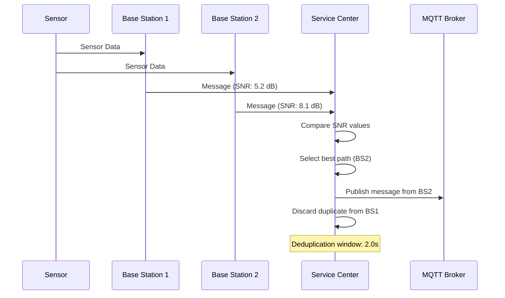
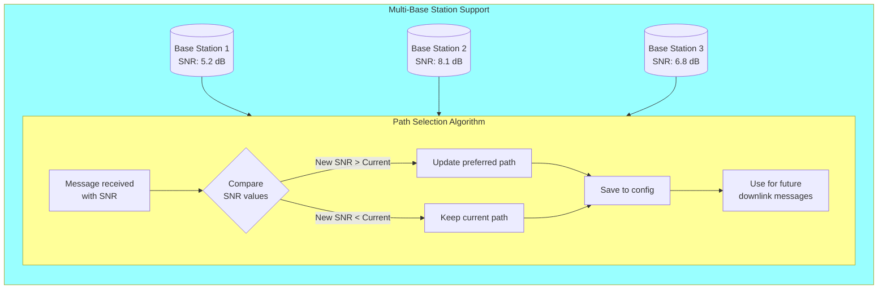

# Advanced Features

## Message Deduplication

The system implements sophisticated message deduplication for multi-base station deployments:

### Configuration

- **Deduplication Delay**: `DEDUPLICATION_DELAY = 2.0` seconds
- **Buffer Management**: Automatic cleanup of processed messages
- **Statistics Tracking**: Real-time duplicate rate monitoring

## Preferred Downlink Path Management

### Signal Quality Tracking

- **SNR Monitoring**: Tracks Signal-to-Noise Ratio for each sensor-base station pair
- **Dynamic Updates**: Continuously updates preferred path based on signal quality
- **Path Persistence**: Stores preferred paths in sensor configuration
- **Multi-Base Station Support**: Handles sensors communicating through multiple base stations

## Queue Management System

### Asynchronous Queue Architecture

- **MQTT Output Queue**: Messages to be published to MQTT broker
- **MQTT Input Queue**: Configuration and command messages from MQTT
- **Queue Monitoring**: Real-time queue size monitoring and statistics
- **Health Checking**: Automatic detection and recovery from queue issues

### Queue Statistics

- Queue sizes and utilization
- Message processing rates
- Error rates and recovery statistics
- Performance metrics and bottleneck detection

## Security Features

### SSL/TLS Security

- **Mutual Authentication**: Base stations must present valid certificates
- **Certificate Validation**: Full chain validation with CA verification
- **Secure Channels**: All communication encrypted with TLS 1.2+
- **Certificate Management**: Web-based certificate upload, generation, and backup

### Access Control

- **Web Interface Security**: Session-based access control with role-based permissions
- **API Protection**: Request validation, sanitization, and role-based permission decorators
- **Certificate-Based Auth**: Base station authentication via client certificates
- **MQTT Security**: Username/password authentication for MQTT broker
