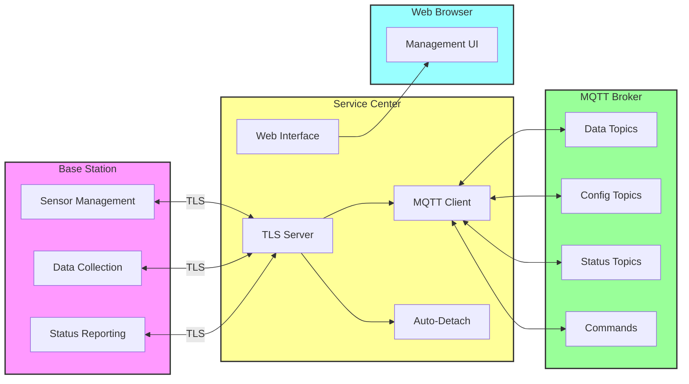

# Introduction

The **BSSCI Service Center** is a comprehensive IoT device management system that provides secure communication between mioty sensors, base stations, and MQTT brokers. It implements the BSSCI (Base Station Service Center Interface) protocol with advanced features for sensor lifecycle management, automatic detachment, and real-time monitoring.

## System Architecture

## Key Components

- **TLS Server**: Secure communication with base stations using BSSCI protocol
- **MQTT Interface**: Bidirectional communication with external systems
- **Web UI**: Real-time management and monitoring dashboard
- **Auto-Detach System**: Automated sensor lifecycle management
- **Certificate Management**: SSL/TLS security infrastructure

## Tested Base Stations

| Manufacturer | Device |
|---|---|
| Diehl Metering | Premium Gateway |
| Weptech | AVA1 |
| Miromico | Edge |
| Diehl Metering | Compact Gateway |
| RAK | WisGate Connect for mioty |

## Next Steps

- [Installation & Setup](./installation.md) - Get started with installation
- [Configuration](./configuration.md) - Configure the service center
- [Docker Deployment](../deployment/docker.md) - Deploy using Docker
