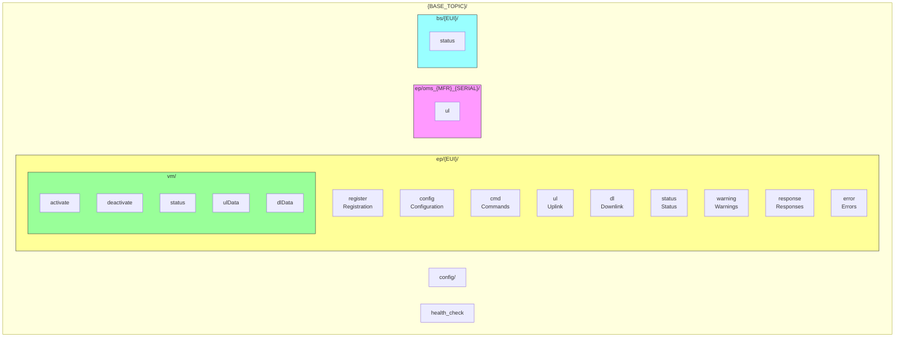

# MQTT Integration

## Unified Topic Structure

The system uses a simplified, unified MQTT topic structure under `{BASE_TOPIC}/ep/{EUI}/`:



## Subscription Topics

| Topic | Description |
|-------|-------------|
| `{BASE_TOPIC}/ep/+/register` | Legacy sensor registration (RECOMMENDED) |
| `{BASE_TOPIC}/ep/+/config` | Alternative sensor configuration |
| `{BASE_TOPIC}/ep/+/cmd` | Unified sensor commands |
| `{BASE_TOPIC}/ep/+/dl` | Downlink messages |
| `{BASE_TOPIC}/config/+` | System configuration |

## Publication Topics

| Topic | Description |
|-------|-------------|
| `{BASE_TOPIC}/ep/{EUI}/ul` | Sensor uplink data |
| `{BASE_TOPIC}/ep/{EUI}/status` | Registration status |
| `{BASE_TOPIC}/ep/{EUI}/response` | Command responses |
| `{BASE_TOPIC}/ep/{EUI}/warning` | Inactivity warnings |
| `{BASE_TOPIC}/ep/oms_{MFR}_{SERIAL}/ul` | OMS meter uplink data |
| `{BASE_TOPIC}/bs/{EUI}` | Base station status |

## Command Responses

All commands receive acknowledgments on: `{BASE_TOPIC}/ep/{EUI}/response`

```json
{
  "command": "attach",
  "status": "received",
  "timestamp": 1703123456.789
}
```

## Complete Sensor Workflow

### Step 1: Register Sensor

```bash
mosquitto_pub -h broker -u user -p pass \
  -t "mioty/ep/FCA84A0300001234/register" \
  -m '{"nwKey": "0011223344556677889AABBCCDDEEFF00", "shortAddr": "1234", "bidi": false}'
```

### Step 2: Control Sensor

```bash
# Attach sensor
mosquitto_pub -h broker -t "mioty/ep/FCA84A0300001234/cmd" -m "attach"

# Detach sensor
mosquitto_pub -h broker -t "mioty/ep/FCA84A0300001234/cmd" -m "detach"

# Request status
mosquitto_pub -h broker -t "mioty/ep/FCA84A0300001234/cmd" -m "status"
```
